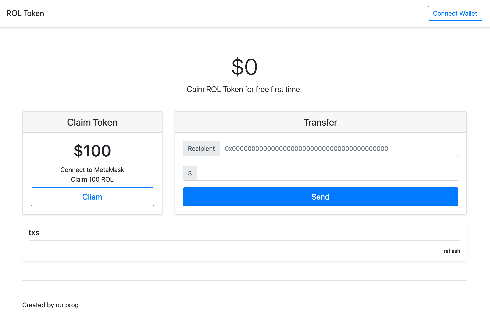

# token-demo

[中文](./README_ZH.md)

A rollup token issued on Arweave.

- Three-party verification
- Fast as traditional Internet applications
- Very cheap
- Support MetaMask, compatible with Ethereum

## Module

### Application Module

#### issuer

Token issuance program, provide the WEB of Token, and token interface.

##### Interface:

- balanceOf: query user's balance
- txsByAddress: query user's transactions
- txs: query all transactions
- submitTx: user signature and submit transaction

#### detectransactions
 transactionstoken detector program automatically loads the data on Arweave after running, and provides an interface to query token transactions.

##### Interface:

- balanceOf: query user's balance
- txsByAddress: query user's transactions
- txs: query all transactions

### Other modules

#### token

token core module, providing ExecuteTx to execute transactions

#### tracker

Arweave data tracking program, parse the data into tx for output

#### web

Application front-end page

#### cache

Save the off-chain calculation state, convenient for API query and output

## Build & Run

After the build is completed, a build folder will be created, containing two applications, issuer and detector.

```shell
make all
```

### issuer

Run the program when the operator issues tokens on its own

Prepare:

1. An AR private key with a certain AR balance, such as 0.1 AR
2. The name of the token
3. The address of the creator who issued the token, which is the AR wallet address in 1 step

Run:

1. Place the keyfile in the application root directory
```shell
./test-keyfile.json
```
2. Run
```shell
GIN_MODE=release \
TOKEN_SYMBOL={{Your token name}} \
TOKEN_OWNER={{Token creator address}} \
KEY_PATH={{Keyfile path}} \
PORT={{HTTP port}} ./build/issuer
```
eg: ***Note!!! You need to add `:` before the PORT. The correct writing is `:80`, not `80`***
```shell
GIN_MODE=release \
TOKEN_SYMBOL=ROL \
TOKEN_OWNER=dQzTM9hXV5MD1fRniOKI3MvPF_-8b2XDLmpfcMN9hi8 \
KEY_PATH='./test-keyfile.json' \
PORT=:80 ./build/issuer
```
3. Click on `Connect Wallet`, use MetaMask for Claim and Transfer



### detector

Transactions from issuer can be checked through the detector.

Prepare:

1. token name
2. The address of the creator who issued the token

Run the program:

```shell
TOKEN_SYMBOL=ROL \
TOKEN_OWNER=dQzTM9hXV5MD1fRniOKI3MvPF_-8b2XDLmpfcMN9hi8 \
PORT=:80 ./build/detector
```

Wait for the program to complete sync, use the following command to query the data:

```shell
curl'http://127.0.0.1/balanceOf/{{wallet address}}' # Query wallet balance
curl'http://127.0.0.1/txs/{{wallet address}}' # Query all transactions of the wallet
curl'http://127.0.0.1/txs' # Query all historical transactions
```

## Development

test

```shell
make test
```
