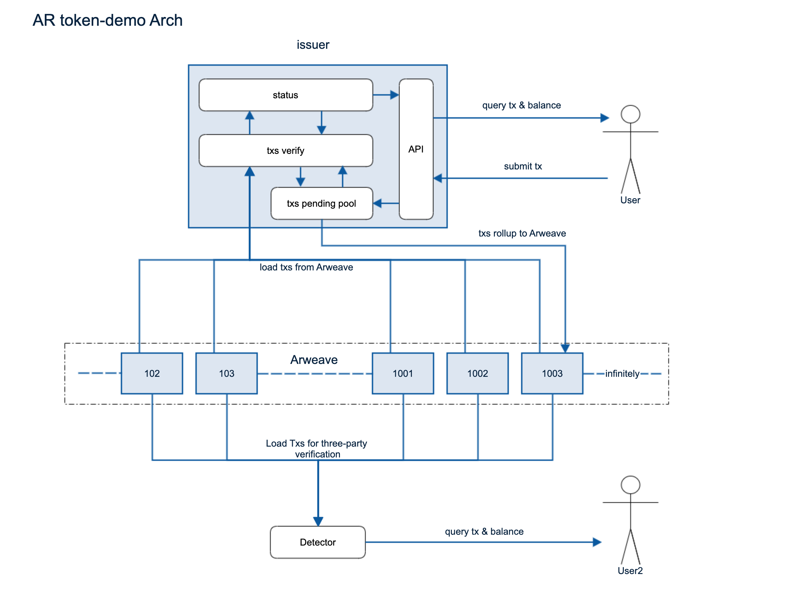

# token-demo

[demo](http://everwallet.io/token/)

发行在 Arweave 上的 rollup token。

- 第三方可验证
- 和传统支付结算一样的速度
- 成本便宜，0.5 美金可以支持 10000 比交易
- 支持 MetaMask，兼容以太坊签名

## 架构图



## 模块说明

### 应用模块

#### issuer

代币发行运营程序，提供 Token 的 WEB 端页面，提供代币接口。

##### 接口：

- balanceOf 查询代币余额
- txsByAddress 查询用户交易记录
- txs 查询所有交易记录
- submitTx 用户签名和提交交易

#### detector

代币验钞机程序，运行后自动加载 Arweave 上的数据，提供接口查询代币交易情况。

##### 接口：

- balanceOf 查询代币余额
- txsByAddress 查询用户交易记录
- txs 查询所有交易记录

### 附属模块

#### token

token 核心功能模块，提供 ExecuteTx 执行交易

#### tracker

Arweave 链上数据跟踪程序，解析数据为 tx 进行输出

#### web

token 前端页面

#### cache

缓存，用于保存链下计算状态，便于 API 进行查询和输出

## 构建和运行

构建应用，构建完成后会创建一个 build 文件夹，包含 issuer 和 detector 两个应用程序

```shell
make all
```

### issuer

运营方自行发行代币时运行该程序

运营方需要准备：

1. 一个 AR 钱包私钥，并有一定的 AR 余额，比如 0.1 AR
2. 发行 token 的名称
3. 发行 token 的创建者地址，即 1 中 AR 钱包地址

运行程序：

1. 将 AR 钱包 keyfile 放在应用根目录下
```shell
./test-keyfile.json
```
2. 运行命令（部分系统下监听 80 端口需要 root 权限）
```shell
GIN_MODE=release \
TOKEN_SYMBOL={{你的 token 名称}} \
TOKEN_OWNER={{token 创建钱包地址}} \
KEY_PATH={{keyfile 路径}} \
PORT={{HTTP 端口}} ./build/issuer
```
示范：***注意!!! 端口号前需要加 `:`，正确的写法是 `:80`，不是 `80`***
```shell
GIN_MODE=release \
TOKEN_SYMBOL=ROL \
TOKEN_OWNER=dQzTM9hXV5MD1fRniOKI3MvPF_-8b2XDLmpfcMN9hi8 \
KEY_PATH='./test-keyfile.json' \
PORT=:80 ./build/issuer
```
3. 运行结果如下图所示，点击右上角 `Connect Wallet`，使用 MetaMask 进行 Claim 和 Transfer
```
http://127.0.0.1/token/
```


### detector

当 issuer 的交易上链后，可以通过 detector 进行交易检查。

检查人需要准备：

1. 发行 token 名称
2. 发行 token 的创建人地址

运行程序：

```shell
TOKEN_SYMBOL=ROL \
TOKEN_OWNER=dQzTM9hXV5MD1fRniOKI3MvPF_-8b2XDLmpfcMN9hi8 \
PORT=:80 ./build/detector
```

等待程序完成同步，使用以下命令查询数据：

```shell
curl 'http://127.0.0.1/balanceOf/{{钱包地址}}' # 查询钱包余额
curl 'http://127.0.0.1/txs/{{钱包地址}}' # 查询钱包所有交易
curl 'http://127.0.0.1/txs' # 查询所有历史交易
```

## 开发

测试

```shell
make test
```
